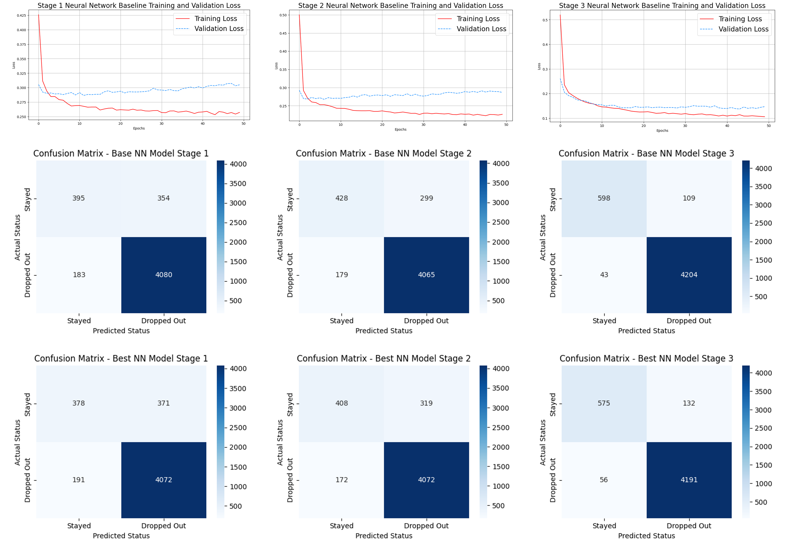

# Retention Intelligence: Predicting Student Dropout with XGBoost and Neural Networks

> **Predicting student dropout risk across the educational journey to enable earlier, revenue-saving, and targeted interventions.**

## ✦ Note
- This project was completed under an NDA. Whilst the company remains anonymous and the code is private, this repository outlines the methodology, architectural approach, and business impact of the work.

## ✦ Overview

- **Problem Statement:** High student dropout rates cause significant revenue loss and reputational damage for educational facilities without reliable early warning systems.
- **Objective:** Build supervised machine learning models to predict dropout across three stages with progressively richer data.
- **Impact:** Enables proactive student support, safeguarding institutional revenue and improving learner outcomes with data-driven insights.

## ✦ Tech Stack

**Python**, **Pandas**, **Scikit-learn**, **SHAP**, **XGBoost**, **TensorFlow**, **Keras**, **Matplotlib**, **Seaborn**

## ✦ Data

- **Source(s):** Three proprietary educational institute datasets.
- **Size:** 25,000+ records with 16-21 features across stages.
- **Notable Characteristics:** The target variable is moderately imbalanced with several categorical features showing very high cardinality (20+).

## ✦ Methodology

- **Preprocessing:** Features with severely high cardinality and missing values were removed, other categorical features one-hot encoded, and continuous variables standardised using a scaler fit on training data to prevent leakage.
- **Feature Engineering:** A triad of highly predictive features identified and used to impute values in features where removal was not appropriate.
- **Modelling:** Tuned XGBoost and sequential MLP Neural Network across a variety of relevant hyperparameters. Both model architectures captured incremental value across temporal stages.
- **Evaluation:** F1 was chosen as the primary tuning and evaluation metric over accuracy since it provides a more robust performance measure against the imbalanced target, ensuring models learn to identify those at risk of dropout as opposed to defaulting to the majority class.

## ✦ Key Results and Outputs

- Best model was a tuned XGBoost model with F1 and Accuracy scores over 0.98 at the final stage.
- A minor performance gain is seen between stages 1 and 2, yet a significant improvement is seen at stage 3. This is where academic performance indicators are included, superseding the predictive power of earlier signals.
- Delivered a reusable, stage-agnostic pipeline (pre-processing, XGBoost/NN training, tuning, and evaluation) consistently applied across data stages.

## ✦ Roadmap and Limitations

- **Limitation:** The hyperparameter search space could be increased to find a more optimal configuration with better performance, such as via Bayesian optimisation with Optuna, as opposed to the current iterative fixed grid used.
- **Future Work:** This work currently treats every course type as independent, including two variations of the same course, such as "Course X" vs "Course X with Placement Year". Therefore, a more nuanced approach should group these records since models show this feature can provide significant predictive signal due to relative course difficulty.